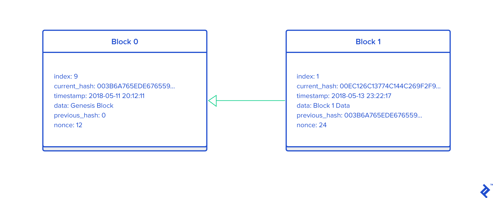
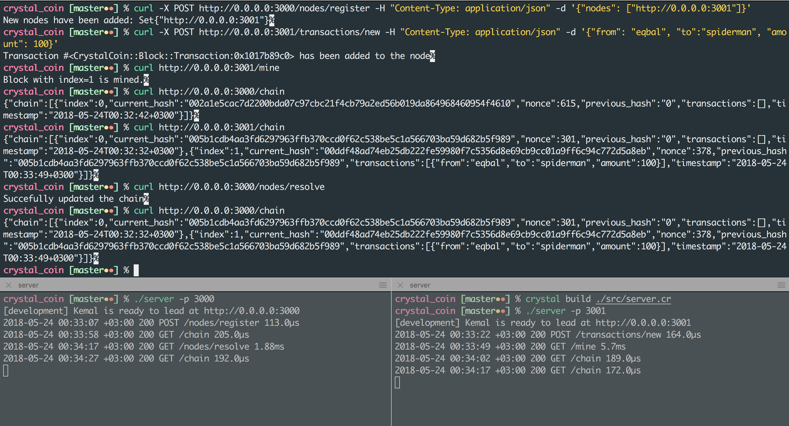

# Creating a CryptoCoin using The Crystal Programming Language


This post is my attempt to understand the key aspects of the blockchain by exploring the internals. I started by reading the [original paper](http://nakamotoinstitute.org/bitcoin/), but I felt the only way to truly understand blockchain is by building a new CryptoCoin from scratch. So that's why I decided to create `CrystalCoin`. We will simplify most of the things like complexity, algorithm choices etc. Focusing on the details of a concrete example will provide a deeper understanding of the strengths and limitations of blockchains.

> If you haven’t read it yet, I suggest you take a look at Demir Selmanvic's [article Cryptocurrency for Dummies: Bitcoin and Beyond]( 
https://www.toptal.com/bitcoin/cryptocurrency-for-dummies-bitcoin-and-beyond) here on the Toptal Engineering Blog as an introduction for Cryptocurrency.

For a better demonstration, I want to use a productive language like [Ruby](https://www.ruby-lang.org/en/) without compromising the performance. Cryptocurrency has many time consuming computations (_mining_ and _hashing_) and that's why a compiled languages (e.g.: `C++`/`JAVA`) are the languages of choice to build real crptocoins. That being said I want to use a language with a cleaner syntax so I can keep the development fun and allow better readability.

So, what I want to use? [Crystal](https://crystal-lang.org/) language. Crystal’s syntax is heavily inspired by Ruby’s, so it feels natural to read and easy to write, and has the added benefit of a lower learning curve, specially for experienced Ruby developers. As they mentioned at their official website:

> Fast as C, slick as Ruby

Unlike Ruby or JavaScript, which are interpreted languages, Crystal is a compiled language, making it much faster and with a lower memory footprint. Under the hood, it uses [LLVM](https://llvm.org/) for compiling to native code.

Crystal is also statically typed, which means that the compiler will help you catch type errors in compile-time.

I'm not gonna talk more about Crystal and why it's awesome as it's out of the scoop of this article, but if you are still not convinced, feel free to check out [this](https://medium.com/@DuroSoft/why-crystal-is-the-most-promising-programming-language-of-2018-aad669d8344f) article.

> I'll assume you have a basic understanding of Object Oriented Programming (OOP).

### Blockchain

So, what is a blockchain? It’s a list (chain) of blocks linked and secured by digital fingerprints (also known as crypto hashes).

The easiest way to think of it as a linked list data structure. That being said a linked list only required to have a reference to the previous element, a block must have an identifier depending on the previous block’s identifier, meaning that you cannot replace a block without recomputing every single block that comes after.

For now think of blockchain as a series of blocks with some data, linked with a chain, the chain being the hash of the previous block.

The entire blockchain would exist on each one of the node that wants to interact with it, meaning it is copied on each one of the nodes in the network. So, no single server hosts it, which makes it _decentralized_.

Yes this is weird compared to the conventional centralized systems. Each of the nodes will have a copy of the entire blockchain (> 149 Gb in Bitcoin blockchain by [December 2017](https://www.statista.com/statistics/647523/worldwide-bitcoin-blockchain-size/)).

### Hashing & Digital Signature

So, what is this hash function? Think of the hash as a function, that when we give it a text/object it would return a unique fingerprint. Even the smallest change in the input object would change the finger print dramatically.

There are different hashing algorithms, in this article we'll be using `SHA256` hash algorithm, which is the one used in `Bitcoin`.

Using `SHA256` we'll always resulting a 64 hexadecimal chars (256 bit) in length even if the input is less than 256 bit or much bigger than 256 bit:


| Input                                                                                                                                                                                                                                                                                                                                                                                                                                                                                                                                                       | Hashed Results                                                   |
|-------------------------------------------------------------------------------------------------------------------------------------------------------------------------------------------------------------------------------------------------------------------------------------------------------------------------------------------------------------------------------------------------------------------------------------------------------------------------------------------------------------------------------------------------------------|------------------------------------------------------------------|
| VERY LONG TEXT VERY LONG TEXT VERY LONG TEXT VERY LONG TEXT VERY LONG TEXT VERY LONG TEX VERY LONG TEXT VERY LONG  VERY LONG TEXT VERY LONG TEXT VERY LONG TEXT VERY LONG TEXT VERY LONG TEXT VERY LONG TEXT VERY LONG TEXT VERY LONG TEXT VERY LONG TEXT VERY LONG TEXT VERY LONG TEXT | cf49bbb21c8b7c078165919d7e57c145ccb7f398e7b58d9a3729de368d86294a |
| Toptal                                                                                                                                                                                                                                                                                                                                                                                                                                                                                                                                                      | 2e4e500e20f1358224c08c7fb7d3e0e9a5e4ab7a013bfd6774dfa54d7684dd21 |
| Toptal.                                                                                                                                                                                                                                                                                                                                                                                                                                                                                                                                                     | 12075307ce09a6859601ce9d451d385053be80238ea127c5df6e6611eed7c6f0 |

Note with the last example, that just adding a `.` (dot) resulted a dramatical changes in the hash.

Therefore, in a blockchain, the chain is built by passing the block data into a hashing algorithm that would generate a hash, which is linked to the next block, henceforth, forming a series of blocks linked with the hashes of the previous blocks.

#### Building CrystalCoin project

Now let's start creating our Crystal project and build our `SHA256` encryption.

Assuming you have your Crystal [installed](https://crystal-lang.org/docs/installation/), let's create the skeleton of `CrystalCoin` codebase by using Crystal's built-in project tooling `crystal init app [name]`:


```
% crystal init app crystal_coin
      create  crystal_coin/.gitignore
      create  crystal_coin/.editorconfig
      create  crystal_coin/LICENSE
      create  crystal_coin/README.md
      create  crystal_coin/.travis.yml
      create  crystal_coin/shard.yml
      create  crystal_coin/src/crystal_coin.cr
      create  crystal_coin/src/crystal_coin/version.cr
      create  crystal_coin/spec/spec_helper.cr
      create  crystal_coin/spec/crystal_coin_spec.cr
Initialized empty Git repository in /Users/eki/code/crystal_coin/.git/
```

This command will create the basic structure for the project, with an already initialized git repository, license and readme files. It also comes with stubs for tests, and the `shard.yml` for describing the project and managing dependencies, also known as shards.

Let’s add the `openssl` shard, which is needed to build `SHA256` algorithm:


```
# shard.yml
dependencies:
  openssl:
    github: datanoise/openssl.cr
```

Once that's in, head back into your terminal and run `crystal deps`. Doing this will pull down `openssl` and its dependencies for us to utilise

Now we have the required library installed in our code, let's start by defining `Block` class and then building the hash function.

```ruby
# src/crystal_coin/block.cr

require "openssl"

module CrystalCoin
  class Block

    def initialize(data : String)
      @data = data
    end

    def hash
      hash = OpenSSL::Digest.new("SHA256")
      hash.update(@data)
      hash.hexdigest
    end
  end
end

puts CrystalCoin::Block.new("Hello, Cryptos!").hash
```

You can now test your application by running crystal run `crystal src/crystal_coin/block.cr` from your terminal

```
crystal_coin [master●] % crystal src/crystal_coin/block.cr
33eedea60b0662c66c289ceba71863a864cf84b00e10002ca1069bf58f9362d5
```

### Design our Blockchain

Each block is stored with a `timestamp` and, optionally, an `index`. In `CrystalCoin`, we’re going to store both. And to help ensure integrity throughout the blockchain, each block will have a self identifying _hash_. Like Bitcoin, each block’s hash will be a cryptographic hash of the block’s (`index`, `timestamp`, `data`, and the hash of the previous block’s hash `previous_hash`). The data can be anything you want for now. 

```ruby
module CrystalCoin
  class Block

    property current_hash : String

    def initialize(index = 0, data = "data", previous_hash = "hash")
      @data = data
      @index = index
      @timestamp = Time.now
      @previous_hash = previous_hash
      @current_hash = hash_block
    end

    private def hash_block
      hash = OpenSSL::Digest.new("SHA256")
      hash.update("#{@index}#{@timestamp}#{@data}#{@previous_hash}")
      hash.hexdigest
    end
  end
end


puts CrystalCoin::Block.new(data: "Same Data").current_hash
```

In Crystal, we replace Ruby's `attr_accessor`, `attr_getter` and `attr_setter` methods with new keywords:

| Ruby Keyword  | Crystal Keyword |
|---------------|-----------------|
| attr_accessor | property        |
| attr_reader   | getter          |
| attr_writer   | setter          |


Another thing you might noticed that in Crystal is that we want to hint the compiler about specific types through our code. Crystal infers the types, but whenever you have ambiguity you can explicitly declare types as well. That's why we added `String` types for `current_hash`.

Now let's run `block.cr` twice and note that the same data will generate different hashes because of the different `timestamp`:

```
crystal_coin [master●] % crystal src/crystal_coin/block.cr
361d0df74e28d37b71f6c5f579ee182dd3d41f73f174dc88c9f2536172d3bb66
crystal_coin [master●] % crystal src/crystal_coin/block.cr
b1fafd81ba13fc21598fb083d9429d1b8a7e9a7120dbdacc7e461791b96b9bf3
```

Cool! We have our block structure, but we’re creating a blockchain. We need to start adding blocks to the actual chain. As I mentioned earlier, each block requires information from the previous block. But how does the first block in the blockchain get there? Well, the first block, or `genesis` block, is a special block (a block with no predecessors). In many cases, it’s added manually or has unique logic allowing it to be added.

We’ll create a new function that returns a genesis block. This block is of `index=0`, and it has an arbitrary data value and an arbitrary value in the `previous_hash` parameter.

Let's build or class method `Block.first` that generates the genesis block:

```ruby
module CrystalCoin
  class Block
  	...
  	
    def self.first(data="Genesis Block")
      Block.new(data: data, previous_hash: "0")
    end
    
    ...
  end
end
```

And let's test it out using `p CrystalCoin::Block.first`:

```
#<CrystalCoin::Block:0x10b33ac80 @current_hash="acb701a9b70cff5a0617d654e6b8a7155a8c712910d34df692db92455964d54e", @data="Genesis Block", @index=0, @timestamp=2018-05-13 17:54:02 +03:00, @previous_hash="0">
```

Now that we’re able to create a _genesis_ block, we need a function that will generate succeeding blocks in the blockchain.

This function will take the previous block in the chain as a parameter, create the data for the block to be generated, and return the new block with its appropriate data. When new blocks hash information from previous blocks, the integrity of the blockchain increases with each new block.

If we didn’t do this, it would be easier for an outside party to change the data and replace our chain with an entirely new one of their own. This chain of hashes acts as cryptographic proof and helps ensure that once a block is added to the blockchain it cannot be replaced or removed. Let's create the class method `Block.next`:

```ruby
module CrystalCoin
  class Block
    ...
    
    def self.next(previous_node, data = "Transaction Data")
      Block.new(
        data: "Transaction data number (#{previous_node.index + 1})",
        index: previous_node.index + 1,
        previous_hash: previous_hash.hash
      )
    end
    ...
  end
end		
```

Let's try it out all together, we'll create a simple  blockchain. The first element of the list is the genesis block. And of course, we need to add the succeeding blocks. We'll create 10 new blocks to demonstrate `CrystalCoin`:

```ruby
blockchain = [ CrystalCoin::Block.first ]

previous_block = blockchain[0]

10.times do |i|
  new_block  = CrystalCoin::Block.next(previous_block: previous_block)
  blockchain << new_block
  previous_block = new_block
  puts new_block.inspect
end

```

```
#<CrystalCoin::Block:0x10e04abc0 @current_hash="a6d92e0787b005f25b7d4b132a71c16bdb2dbabad917d82bcdae6f2aac87b2a2", @index=1, @data="Transaction data number (1)", @timestamp=2018-05-13 23:22:17 +03:00, @previous_hash="c3b15c18b025cebaaa7302254910708d2ace1dd05b1a489034c25c87e579e889">
#<CrystalCoin::Block:0x10e04aa80 @current_hash="fc0566969686cd3e9cb70e6bae86019e89b41a601fab874364df4937254c71b9", @index=2, @data="Transaction data number (2)", @timestamp=2018-05-13 23:22:17 +03:00, @previous_hash="a6d92e0787b005f25b7d4b132a71c16bdb2dbabad917d82bcdae6f2aac87b2a2">
#<CrystalCoin::Block:0x10e04a980 @current_hash="cfec59ec174f7efccacd0de52a771116dae7084e38cd69cff4c6309b3da86bc5", @index=3, @data="Transaction data number (3)", @timestamp=2018-05-13 23:22:17 +03:00, @previous_hash="fc0566969686cd3e9cb70e6bae86019e89b41a601fab874364df4937254c71b9">
#<CrystalCoin::Block:0x10e04a880 @current_hash="1e50b43d893b832d210ab95777f81c413cc10b30a78b8f1a0ed895a7a8766ea0", @index=4, @data="Transaction data number (4)", @timestamp=2018-05-13 23:22:17 +03:00, @previous_hash="cfec59ec174f7efccacd0de52a771116dae7084e38cd69cff4c6309b3da86bc5">
#<CrystalCoin::Block:0x10e04a780 @current_hash="3ba86566e340209cfc8e59572dc76c1caa191752894d9e31da14db7e00902376", @index=5, @data="Transaction data number (5)", @timestamp=2018-05-13 23:22:17 +03:00, @previous_hash="1e50b43d893b832d210ab95777f81c413cc10b30a78b8f1a0ed895a7a8766ea0">
#<CrystalCoin::Block:0x10e04a680 @current_hash="4edc238c38efb37311129201f6938aaa6b170d95d51112745b738cd9cb738386", @index=6, @data="Transaction data number (6)", @timestamp=2018-05-13 23:22:17 +03:00, @previous_hash="3ba86566e340209cfc8e59572dc76c1caa191752894d9e31da14db7e00902376">
#<CrystalCoin::Block:0x10e04a580 @current_hash="e5974f5fef832fe6a3d81c7cf8342c05d198d114da5c333cbe85e84e30344567", @index=7, @data="Transaction data number (7)", @timestamp=2018-05-13 23:22:17 +03:00, @previous_hash="4edc238c38efb37311129201f6938aaa6b170d95d51112745b738cd9cb738386">
#<CrystalCoin::Block:0x10e04a480 @current_hash="ec308e41c8361fe6d11eb99c89a67f4173446fcf683d9e109511fcb20782c2ab", @index=8, @data="Transaction data number (8)", @timestamp=2018-05-13 23:22:17 +03:00, @previous_hash="e5974f5fef832fe6a3d81c7cf8342c05d198d114da5c333cbe85e84e30344567">
#<CrystalCoin::Block:0x10e04a380 @current_hash="035dd1a88f47f534b09a6d43b1ee2be365df6beb87b03edb4750489d82f3178b", @index=9, @data="Transaction data number (9)", @timestamp=2018-05-13 23:22:17 +03:00, @previous_hash="ec308e41c8361fe6d11eb99c89a67f4173446fcf683d9e109511fcb20782c2ab">
#<CrystalCoin::Block:0x10e04a280 @current_hash="47a43a7e9a980dc3e7d08c671a02d44f7293e41a7c2059c7f118c1e0a562b6e3", @index=10, @data="Transaction data number (10)", @timestamp=2018-05-13 23:22:17 +03:00, @previous_hash="035dd1a88f47f534b09a6d43b1ee2be365df6beb87b03edb4750489d82f3178b">
```

### Proof-of-Work

A Proof of Work algorithm (PoW) is how new Blocks are created or _mined_ on the blockchain. The goal of PoW is to discover a number which solves a problem. The number must be difficult to find but easy to verify computationally by anyone on the network. This is the core idea behind Proof of Work.

Let's explain by an example so things will get clearer.

We'll assume that the hash of some integer x multiplied by another y must starts with `00`. So:

```
hash(x * y) = 00ac23dc...
```

And for this simplified example, let’s fix `x=5`. Implementing this in Crystal:

```ruby
x = 5
y = 0

while hash((x*y).to_s)[0..1] != "00"
  y += 1
end

puts "The solution is y = #{y}"
puts "Hash(#{x}*#{y}) = #{hash((x*y).to_s)}"
```

Let's run the code:

```
crystal_coin [master●●] % time crystal src/crystal_coin/pow.cr
The solution is y = 530
Hash(5*530) = 00150bc11aeeaa3cdbdc1e27085b0f6c584c27e05f255e303898dcd12426f110
crystal src/crystal_coin/pow.cr  1.53s user 0.23s system 160% cpu 1.092 total
```

As you can see this number `y=530` was hard to find (brute-force), but easy to verify using the hash function.

Why to bother with this PoW algorithm? We don't just create one hash per block and that's it. A hash must be _valid_. In our case, a hash will be valid if the first two characters of our hash are `00`. If our hash starts with `00......`, it is considered valid. This is called the *difficulty*. The higher the difficulty, the longer it takes to get a valid hash.

But, if the hash is not valid the first time, something must change in the data we use. If we use the same data over and over, we will get the same hash over and over and our hash will never be valid. We use something called `nonce` in our hash (in our previous example it's the `y`). It is simply a number that we increment each time the hash is not valid. We get our data (date, message, previous hash, index) and a nonce of 1. If the hash we get with these is not valid, we try with a nonce of 2. And we increment the nonce until we get a valid hash.

In Bitcoin, the Proof of Work algorithm is called [Hashcash](https://en.wikipedia.org/wiki/Hashcash). Let's add a proof-of-work to our Block class and start _mining_ to find the nonce. We'll use a hard-coded _difficulty_ of two leading zeros '00':

Now let's redesign our Block class to support that. Our `CrystalCoin` Block will contain the follwoing attributes:

```
1) index: indicates the index of the block ex: 0,1
2) timestamp: timestamp in epoch, number of seconds since 1 Jan 1970
3) data: the actual data that needs to be stored on blockchain.
4) previous_hash: the hash of the previous block, this is the chain/link between the blocks
5) nonce: this is the number that is to be mined/found.
6) currnt_hash: The hash value of the current block, this is generated by combining all the above attributes and passing it to a hashing algorithm
```

.

I'll create a separate module to do the hashing and find the `nonce` so we keep our code clean and modular. I'll call it `proof_of_work.cr`:

```ruby
require "openssl"

module CrystalCoin
  module ProofOfWork

    private def proof_of_work(difficulty = "00")
      nonce = 0
      loop do
        hash = calc_hash_with_nonce(nonce)
        if hash[0..1] == difficulty
          return nonce
        else
          nonce += 1
        end
      end
    end

    private def calc_hash_with_nonce(nonce = 0)
      sha = OpenSSL::Digest.new("SHA256")
      sha.update("#{nonce}#{@index}#{@timestamp}#{@data}#{@previous_hash}")
      sha.hexdigest
    end
  end
end
```

Our `Block` class would look something like:

```ruby
require "./proof_of_work"

module CrystalCoin
  class Block
    include ProofOfWork

    property current_hash : String
    property index : Int32
    property nonce : Int32
    property previous_hash : String


    def initialize(index = 0, data = "data", previous_hash = "hash")
      @data = data
      @index = index
      @timestamp = Time.now
      @previous_hash = previous_hash
      @nonce = proof_of_work
      @current_hash = calc_hash_with_nonce(@nonce)
    end

    def self.first(data = "Genesis Block")
      Block.new(data: data, previous_hash: "0")
    end

    def self.next(previous_block, data = "Transaction Data")
      Block.new(
        data: "Transaction data number (#{previous_block.index + 1})",
        index: previous_block.index + 1,
        previous_hash: previous_block.current_hash
      )
    end
  end
end

```

Few things to note about Crystal code. In Crystal methods are public by default, Crystal requires each private method to be prefixed with the private keyword which could be confusing coming from Ruby.

You might noticed that for Crystal's Integer types there are `Int8`, `Int16`, `Int32`, `Int64`, `UInt8`, `UInt16`, `UInt32`, or `UInt64` compared to Ruby's `Fixnum`. `true` and `false` are values in the `Bool` class rather than values in classes `TrueClass` or `FalseClass` in Ruby.

Crystal has optional and named method arguments as core language features, and does not require writing special code for handling the arguments which is pretty cool. Check out `Block#initialize(index = 0, data = "data", previous_hash = "hash")` and then calling it with something like `Block.new(data: data, previous_hash: "0")`.

For a more detailed list of differences between Crystal and Ruby programming language check out [Crystal for Rubyists](https://github.com/crystal-lang/crystal/wiki/Crystal-for-Rubyists).

Now, let's try to create 5 transactions using:

```ruby
blockchain = [ CrystalCoin::Block.first ]
puts blockchain.inspect
previous_block = blockchain[0]

5.times do |i|
  new_block  = CrystalCoin::Block.next(previous_block: previous_block)
  blockchain << new_block
  previous_block = new_block
  puts new_block.inspect
end
```

```
[#<CrystalCoin::Block:0x108f8fea0 @current_hash="0088ca080a49334e1cb037ed4c42795d635515ef1742e6bcf439bf0f95711759", @index=0, @nonce=17, @timestamp=2018-05-14 17:20:46 +03:00, @data="Genesis Block", @previous_hash="0">]
#<CrystalCoin::Block:0x108f8f660 @current_hash="001bc2b04d7ad8ef25ada30e2bde19d7bbbbb3ad42348017036b0d4974d0ccb0", @index=1, @nonce=24, @timestamp=2018-05-14 17:20:46 +03:00, @data="Transaction data number (1)", @previous_hash="0088ca080a49334e1cb037ed4c42795d635515ef1742e6bcf439bf0f95711759">
#<CrystalCoin::Block:0x109fc5ba0 @current_hash="0019256c998028111838b872a437cd8adced53f5e0f8f43388a1dc4654844fe5", @index=2, @nonce=61, @timestamp=2018-05-14 17:20:46 +03:00, @data="Transaction data number (2)", @previous_hash="001bc2b04d7ad8ef25ada30e2bde19d7bbbbb3ad42348017036b0d4974d0ccb0">
#<CrystalCoin::Block:0x109fdc300 @current_hash="0080a30d0da33426a1d4f36d870d9eb709eaefb0fca62cc68e497169c5368b97", @index=3, @nonce=149, @timestamp=2018-05-14 17:20:46 +03:00, @data="Transaction data number (3)", @previous_hash="0019256c998028111838b872a437cd8adced53f5e0f8f43388a1dc4654844fe5">
#<CrystalCoin::Block:0x109ff58a0 @current_hash="00074399d51c700940e556673580a366a37dec16671430141f6013f04283a484", @index=4, @nonce=570, @timestamp=2018-05-14 17:20:46 +03:00, @data="Transaction data number (4)", @previous_hash="0080a30d0da33426a1d4f36d870d9eb709eaefb0fca62cc68e497169c5368b97">
#<CrystalCoin::Block:0x109fde120 @current_hash="00720bb6e562a25c19ecd2b277925057626edab8981ff08eb13773f9bb1cb842", @index=5, @nonce=475, @timestamp=2018-05-14 17:20:46 +03:00, @data="Transaction data number (5)", @previous_hash="00074399d51c700940e556673580a366a37dec16671430141f6013f04283a484">
```
See the difference? Now all hashes start with `00`. That's the magic of the proof-of-work. Using `ProofOfWork` we found the `nonce` and proof is the hash with the matching difficulty, that is, the two leading zeros `00`.

Note with the first block we created, we tried 17 nonces until finding the matching lucky number:

| Block | Loops / Number of Hash calculations |
|-------|-------------------------------------|
| #0    | 17                                  |
| #1    | 24                                  |
| #2    | 61                                  |
| #3    | 149                                 |
| #4    | 570                                 |
| #5    | 475                                 |

Now let's try a difficulty of four leading zeros (`difficulty="0000"`):

| Block | Loops / Number of Hash calculations |
|-------|-------------------------------------|
| #1    | 26 762                              |
| #2    | 68 419                              |
| #3    | 23 416                              |
| #4    | 15 353                              |

In the first block tried 26762 nonces (compare 17 nonces with difficulty '00') until finding the matching lucky number.

### Our Blockchain as an API

So far, so good. We created our simple blockchain and it was relatively easy to make. But the problem here is that `CrystalCoin` can only ran on one single machine (it's not distributed/decentralized).

From now on we'll start using JSON data for `CrystalCoin`, the data will be transactions, so each block’s data field will be a list of transactions.

Each transaction will be a JSON object detailing the `sender` of the coin, the `receiver` of the coin, and the `amount` of CrystalCoin that is being transferred:

```
{
  "from": "71238uqirbfh894-random-public-key-a-alkjdflakjfewn204ij",
  "to": "93j4ivnqiopvh43-random-public-key-b-qjrgvnoeirbnferinfo",
  "amount": 3
}
```

A few modifications to our `Block` class to support the new `transaction` format (previously	called `data`). So, just to avoid confusion and maintain consistency, we'll be using the term `transaction` to refer to `data` posted in our example application from now on.

We'll introduce a new simple class `Transaction`:

```ruby
module CrystalCoin
  class Block
    class Transaction

      property from : String
      property to : String
      property amount : Int32

      def initialize(@from, @to, @amount)
      end
    end
  end
end
```

The transactions are packed into blocks. So a block can contain one or many transactions. The blocks containing the transactions are generated frequently and added to the blockchain. 

The blockchain is supposed to be a collection of blocks. We can store all of the blocks in the Crystal list, and that's why we introduce the new class `Blockchain`:

`Blockchain` will have `chain` and `uncommitted_transactions` arrays. The `chain` will include all the mined blocks in the blockchain, and `uncommitted_transactions` will have all the transactions that has not been added to the blockchain (still not mined). Once we initialize `Blockchain`, we create the genesis block using `Block.first` and add it to `chain` array, and we add an empty `uncommitted_transactions` array. 

We will create `Blockchain#add_transaction` method to add transactions to `uncommitted_transactions` array.

Let's build our new `Blockchain` class:

```ruby
require "./block"
require "./transaction"

module CrystalCoin
  class Blockchain
    getter chain
    getter uncommitted_transactions

    def initialize
      @chain = [ Block.first ]
      @uncommitted_transactions = [] of Block::Transaction
    end

    def add_transaction(transaction)
      @uncommitted_transactions << transaction
    end
  end
end

```

In `Block` class we will start using `transactions` instead of `data`:

```ruby
module CrystalCoin
  class Block
    include ProofOfWork

    def initialize(index = 0, transactions = [] of Transaction, previous_hash = "hash")
      @transactions = transactions
      ...
    end

    ....

    def self.next(previous_block, transactions = [] of Transaction)
      Block.new(
        transactions: transactions,
        index: previous_block.index + 1,
        previous_hash: previous_block.current_hash
      )
    end

  end
end
```

Now that we know what our transactions will look like, we need a way to add them to one of the computers in our blockchain network, called a `node`. To do that, we’ll create a simple HTTP server.

We'll create four end-points:

- [POST]`/transactions/new`: to create a new transaction to a block
- [GET] `/mine`: to tell our server to mine a new block.
- [GET] `/chain`: to return the full blockchain in `JSON` format.
- [GET] `/pending`: to return the pending transactions (`uncommitted_transactions`).

We're going to use [Kermal](https://github.com/kemalcr/kemal) web framework. It’s a micro-framework and it makes it easy to map endpoints to Crystal functions. Kemal is heavily influenced by [Sinatra](http://sinatrarb.com/) for Rubyists, and works in a very similar way. If you are looking for [Ruby on Rails](https://rubyonrails.org/) equivalent then check out [Amber](https://github.com/amberframework/amber). 

Our server will form a single node in our blockchain network. Let's first add `Kemal` to the `shard.yml` file as a and install the dependency:

```
dependencies:
  kemal:
    github: kemalcr/kemal
```

Now let's build the skeleton of our HTTP server:

```ruby
# src/server.cr

require "kemal"
require "./crystal_coin"

# Generate a globally unique address for this node
node_identifier = UUID.random.to_s

# Create our Blockchain
blockchain = Blockchain.new

get "/chain" do
  "Send the blockchain as json objects"
end

get "/mine" do
  "We'll mine a new Block"
end

get "/pending" do
  "Send pending transactions as json objects"
end

post "/transactions/new" do
  "We'll add a new transaction"
end

Kemal.run
```

And run the server:

```
crystal_coin [master●●] % crystal run src/server.cr
[development] Kemal is ready to lead at http://0.0.0.0:3000
```

Let's make sure the server is working fine: 

```
% curl http://0.0.0.0:3000/chain
Send the blockchain as json objects%
```

Ok, so far so good. Now we can proceed with implementing each of the endpoints. Let's start with implementing `/transactions/new` and `pending` end-points:

```ruby
get "/pending" do
  { transactions: blockchain.uncommitted_transactions }.to_json
end

post "/transactions/new" do |env|

  transaction = CrystalCoin::Block::Transaction.new(
    from: env.params.json["from"].as(String),
    to:  env.params.json["to"].as(String),
    amount:  env.params.json["amount"].as(Int64)

  )

  blockchain.add_transaction(transaction)

  "Transaction #{transaction} has been added to the node"
end

```

Straight forward implementation. We just create a `CrystalCoin::Block::Transaction` object and add the transaction to the `uncommitted_transactions` array using `Blockchain#add_transaction`.

At the moment, the transactions are initially stored in a pool of `uncommitted_transactions`. The process of putting the unconfirmed transactions in a block and computing Proof of Work (PoW) is known as the _mining_ of blocks. Once the `nonce` satisfying our constraints is figured out, we can say that a block has been mined, and the block is put into the blockchain.

In `CrystalCoin`, we’ll use the simple Proof-of-Work algorithm we created earlier. To create a new block, a miner’s computer will have to:

- Find the last block in the `chain`.
- Find pending transactions (`uncommitted_transactions`).
- Create a new block using `Block.next`.
- Add the mined block to `chain` array.
- Clean up `uncommitted_transactions` array.

So to implement `/mine` end-point, let's first implement the above steps in `Blockchain#mine`:

```ruby
module CrystalCoin
  class Blockchain
    include Consensus

    BLOCK_SIZE = 25

    ...
    
    def mine
       raise "No transactions to be mined" if @uncommitted_transactions.empty?

       new_block = Block.next(
         previous_block: @chain.last,
         transactions: @uncommitted_transactions.shift(BLOCK_SIZE)
       )

       @chain << new_block
    end
  end
end
```

We make sure first we have some pending transactions to mine. Then we get the last block using `@chain.last`, and the first `25` transactions to be mined (we are using `Array#shift(BLOCK_SIZE)` to return an array of the first 25 `uncommitted_transactions`, and then remove the elements starting at index 0).

Now let's implement `/mine` end-point:

```ruby
get "/mine" do
  blockchain.mine
  "Block with index=#{blockchain.chain.last.index} is mined."
end
```

And for `/chain` end-point:

```ruby
get "/chain" do
  { chain: blockchain.chain }.to_json
end
```

#### Interacting with our Blockchain

We'll be using `cURL` to interact with our API over a network.

First let's fire up the server:

```bash
crystal_coin [master] % crystal run src/server.cr
[development] Kemal is ready to lead at http://0.0.0.0:3000
```

Then let's create two new transactions by making a `POST` requests to `http://localhost:3000/transactions/new` with a body containing our transaction structure:

```bash
crystal_coin [master●] % curl -X POST http://0.0.0.0:3000/transactions/new -H "Content-Type: application/json" -d '{"from": "eki", "to":"iron_man", "amount": 1000}'
Transaction #<CrystalCoin::Block::Transaction:0x10c4159f0 @from="eki", @to="iron_man", @amount=1000_i64> has been added to the node%                                               
crystal_coin [master●] % curl -X POST http://0.0.0.0:3000/transactions/new -H "Content-Type: application/json" -d '{"from": "eki", "to":"hulk", "amount": 700}'
Transaction #<CrystalCoin::Block::Transaction:0x10c415810 @from="eki", @to="hulk", @amount=700_i64> has been added to the node%
```

Now let's list the pending transactions (transactions that has not been added to the block yet):

```bash
crystal_coin [master●] % curl http://0.0.0.0:3000/pendings
{
  "transactions":[
    {
      "from":"ekis",
      "to":"huslks",
      "amount":7090
    },
    {
      "from":"ekis",
      "to":"huslks",
      "amount":70900
    }
  ]
}
```

So far so good, we can see, the two transactions we created earlier have been added to the `uncommitted_transactions`.

Now let's _mine_ the two transactions by making a `GET` request to `http://0.0.0.0:3000/mine`:

```bash
crystal_coin [master●] % curl http://0.0.0.0:3000/mine
Block with index=1 is mined.
```

Nice, sounds we successfully mined the first block and added it to our `chain`. Let's double check our `chain` and if it includes the mined block:

```bash
crystal_coin [master●] % curl http://0.0.0.0:3000/chain
{
  "chain": [
    {
      "index": 0,
      "current_hash": "00d469d383005b4303cfa7321c02478ce76182564af5d16e1a10d87e31e2cb30",
      "nonce": 363,
      "previous_hash": "0",
      "transactions": [
        
      ],
      "timestamp": "2018-05-23T01:59:52+0300"
    },
    {
      "index": 1,
      "current_hash": "003c05da32d3672670ba1e25ecb067b5bc407e1d5f8733b5e33d1039de1a9bf1",
      "nonce": 320,
      "previous_hash": "00d469d383005b4303cfa7321c02478ce76182564af5d16e1a10d87e31e2cb30",
      "transactions": [
        {
          "from": "ekis",
          "to": "huslks",
          "amount": 7090
        },
        {
          "from": "ekis",
          "to": "huslks",
          "amount": 70900
        }
      ],
      "timestamp": "2018-05-23T02:02:38+0300"
    }
  ]
}
```

### Consensus and decentralization

This is very cool. We’ve got a basic blockchain that accepts transactions and allows us to mine new blocks. But the code that we've implemented till now is meant to run on a single computer, while the whole point of Blockchains is that they should be decentralized. And if they’re decentralized, how we ensure that they all reflect the same chain? This is called the problem of `Consensus`.

We’ll have to implement a Consensus Algorithm if we want more than one node in our network.

#### Registering new Nodes

To implement a Consensus Algorithm, we need a way to let a node know about neighbouring nodes on the network. Each node on our network should keep a registry of other nodes on the network. Thus, we’ll need some more endpoints:

- [POST] `/nodes/register`: to accept a list of new nodes in the form of URLs.
- [GET]: `/nodes/resolve`: to implement our Consensus Algorithm, which resolves any conflicts—to ensure a node has the correct chain.

We’ll need to modify our `Blockchain`’s constructor and provide a method for registering nodes:

```diff
--- a/src/crystal_coin/blockchain.cr
+++ b/src/crystal_coin/blockchain.cr
@@ -7,10 +7,12 @@ module CrystalCoin

     getter chain
     getter uncommitted_transactions
+    getter nodes

     def initialize
       @chain = [ Block.first ]
       @uncommitted_transactions = [] of Block::Transaction
+      @nodes = Set(String).new [] of String
     end

     def add_transaction(transaction)
```

Note that we’ve used a `Set` data structure with `String` type to hold the list of nodes. This is a cheap way of ensuring that the addition of new nodes is idempotent, and that no matter how many times we add a specific node, it appears exactly once.

Now let's add a new module to `Consensus` and implement the first method `register_node(address)`:

```ruby
require "uri"

module CrystalCoin
  module Consensus
    def register_node(address : String)
      uri = URI.parse(address)
      node_address = "#{uri.scheme}:://#{uri.host}"
      node_address = "#{node_address}:#{uri.port}" unless uri.port.nil?
      @nodes.add(node_address)
    rescue
      raise "Invalid URL"
    end
  end
end
```

The `register_node` function, will parse the URL of the node and format it.

And here let's create `/nodes/register` end-point:

```ruby
post "/nodes/register" do |env|
  nodes = env.params.json["nodes"].as(Array)

  raise "Empty array" if nodes.empty?

  nodes.each do |node|
    blockchain.register_node(node.to_s)
  end

  "New nodes have been added: #{blockchain.nodes}"
end
```

Now with this implementation we might face a problem with multiple nodes. The copy of chains of a few nodes can differ. In that case, we need to agree upon some version of the chain to maintain the integrity of the entire system. We need to achieve consensus.

To resolve this, we’ll make the rule that the longest valid chain is the one to be used. Using this algorithm, we reach consensus amongst the nodes in our network. The reason behind this approach is that the longest chain is a good estimate of the most amount of work done:


```ruby
module CrystalCoin
  module Consensus
    ...
    
    def resolve
      updated = false

      @nodes.each do |node|
        node_chain = parse_chain(node)
        return unless node_chain.size > @chain.size
        return unless valid_chain?(node_chain)
        @chain = node_chain
        updated = true
      rescue IO::Timeout
        puts "Timeout!"
      end

      updated
    end
    
	...
  end
end

```

`resolve` is a method which loops through all our neighbouring nodes, downloads their chains and verifies them using the `valid_chain?` method. If a valid chain is found, whose length is greater than ours, we replace ours.

Now let's implement `parse_chain()` and `valid_chain?()` private methods:

```ruby
module CrystalCoin
  module Consensus
    ...
    
    private def parse_chain(node : String)
      node_url = URI.parse("#{node}/chain")
      node_chain = HTTP::Client.get(node_url)
      node_chain = JSON.parse(node_chain.body)["chain"].to_json

      Array(CrystalCoin::Block).from_json(node_chain)
    end

    private def valid_chain?(node_chain)
      previous_hash = "0"

      node_chain.each do |block|
        current_block_hash = block.current_hash
        block.recalculate_hash

        return false if current_block_hash != block.current_hash
        return false if previous_hash != block.previous_hash
        return false if current_block_hash[0..1] != "00"
        previous_hash = block.current_hash
      end

      return true
    end
  end
end
```

For `parse_chain()` we: 

- Issue a `GET` HTTP request using `HTTP::Client.get` to `/chain` end-point.
- Parse the `/chain` JSON response using `JSON.parse`.
- Extract an array of `CrystalCoin::Block` objects from the JSON blob that was returned using `Array(CrystalCoin::Block).from_json(node_chain)`. We used Crystal's super-handy `JSON.mapping` functionality that allowed us to use `ObjectType.from_json(json_response)`. In our case we had to define `JSON.mapping` in `CrystalCoin::Block` object something like:

```ruby
module CrystalCoin
  class Block
   
    JSON.mapping(
      index: Int32,
      current_hash: String,
      nonce: Int32,
      previous_hash: String,
      transactions: Array(Transaction),
      timestamp: Time
    )
    
    ...
  end
end
```

Now for `Blockchain#valid_chain?`, we iterate through all of the blocks, and for each we:

- Recalculate the hash for the block using `Block#recalculate_hash` and check that the hash of the block is correct:

```ruby
module CrystalCoin
  class Block
    ...
    
    def recalculate_hash
      @nonce = proof_of_work
      @current_hash = calc_hash_with_nonce(@nonce)
    end
  end
end
	
``` 

- Check each of the blocks linked correctly with their previous hashes.

- Check the block's hash is valid for the number of zeros (`difficulty` in our case `00`).

And finally we implement `/nodes/resolve` end-point:

```ruby
get "/nodes/resolve" do
  if blockchain.resolve
    "Succefully updated the chain"
  else
    "Current chain is up-to-dated"
  end
end

```

It's done! You can find the [final code](https://github.com/eqbal/crystal_coin) on GitHub.

The structure of our project should look like this:

```
crystal_coin [master●] % tree src/
src/
├── crystal_coin
│   ├── block.cr
│   ├── blockchain.cr
│   ├── consensus.cr
│   ├── proof_of_work.cr
│   ├── transaction.cr
│   └── version.cr
├── crystal_coin.cr
└── server.cr
```

### Let's try it out

- Grab a different machine, and run different nodes on your network. Or spin up processes using different ports on the same machine. In my case, I created two nodes on my machine, on a different port to have two nodes: `http://localhost:3000` and `http://localhost:3001`.

- Register the second node address to the first node using:

```
crystal_coin [master●●] % curl -X POST http://0.0.0.0:3000/nodes/register -H "Content-Type: application/json" -d '{"nodes": ["http://0.0.0.0:3001"]}'
New nodes have been added: Set{"http://0.0.0.0:3001"}%
```

- Let's add a transaction to the second node:

```
crystal_coin [master●●] % curl -X POST http://0.0.0.0:3001/transactions/new -H "Content-Type: application/json" -d '{"from": "eqbal", "to":"spiderman", "amount": 100}'
Transaction #<CrystalCoin::Block::Transaction:0x1039c29c0> has been added to the node%
```

- Let's mine transactions into a block at the second node:

```
crystal_coin [master●●] % curl http://0.0.0.0:3001/mine
Block with index=1 is mined.%
```

- At this point, the first node has only one block (genesis block), and the second node has two nodes (genesis and the mined block):

```
crystal_coin [master●●] % curl http://0.0.0.0:3000/chain
{"chain":[{"index":0,"current_hash":"00fe9b1014901e3a00f6d8adc6e9d9c1df03344dda84adaeddc8a1c2287fb062","nonce":157,"previous_hash":"0","transactions":[],"timestamp":"2018-05-24T00:21:45+0300"}]}%
```

```
crystal_coin [master●●] % curl http://0.0.0.0:3001/chain
{"chain":[{"index":0,"current_hash":"007635d82950bc4b994a91f8b0b20afb73a3939e660097c9ea8416ad614faf8e","nonce":147,"previous_hash":"0","transactions":[],"timestamp":"2018-05-24T00:21:38+0300"},{"index":1,"current_hash":"00441a4d9a4dfbab0b07acd4c7639e53686944953fa3a6c64d2333a008627f7d","nonce":92,"previous_hash":"007635d82950bc4b994a91f8b0b20afb73a3939e660097c9ea8416ad614faf8e","transactions":[{"from":"eqbal","to":"spiderman","amount":100}],"timestamp":"2018-05-24T00:23:57+0300"}]}%
```

- Our goal is to update the chain in the first node to include the newly generated block at the second one. So let's resolve the first node:

```
crystal_coin [master●●] % curl http://0.0.0.0:3000/nodes/resolve
Succefully updated the chain%
```

Let's check if the chain in the first node has updated:

```
crystal_coin [master●●] % curl http://0.0.0.0:3000/chain
{"chain":[{"index":0,"current_hash":"007635d82950bc4b994a91f8b0b20afb73a3939e660097c9ea8416ad614faf8e","nonce":147,"previous_hash":"0","transactions":[],"timestamp":"2018-05-24T00:21:38+0300"},{"index":1,"current_hash":"00441a4d9a4dfbab0b07acd4c7639e53686944953fa3a6c64d2333a008627f7d","nonce":92,"previous_hash":"007635d82950bc4b994a91f8b0b20afb73a3939e660097c9ea8416ad614faf8e","transactions":[{"from":"eqbal","to":"spiderman","amount":100}],"timestamp":"2018-05-24T00:23:57+0300"}]}%
```



Hooray, works like a charm.

### Conclusion 

This tutorial covered the fundamentals of a public blockchain. If you followed along, you implemented a blockchain from scratch and built a simple application allowing users to share information on the blockchain.

We’ve made a fairly sized blockchain at this point. Now, `CrystalCoin` can be launched on multiple machines to create a network, and real `CrystalCoins` can be mined.

I hope that this has inspired you to create something new. 

> Note: code in this tutorial is not ready for real use. Please refer to this as a general guide only.
